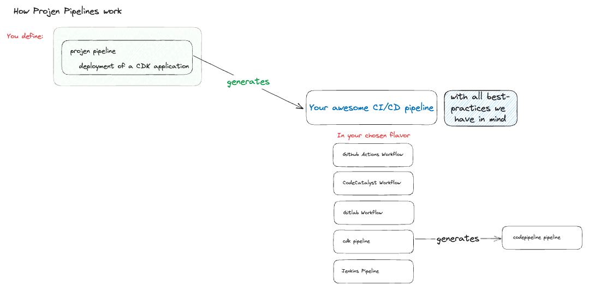

# Projen Pipelines

[](https://www.npmjs.com/package/projen-pipelines)

Projen Pipelines is an open-source project that automates the generation of CI/CD pipelines using Projen,
a project configuration tool created by the inventor of AWS CDK.
It provides high-level abstractions for defining continuous delivery (CD) pipelines for applications,
specifically designed to work with the projen project configuration engine.

### Key Features

* Automates code generation for CI/CD pipelines
* Supports multiple CI/CD platforms (currently GitHub Actions and GitLab CI, with more in development)
* Provides baked-in proven defaults for pipeline configurations
* Enables compliance-as-code integration
* Allows easy switching between different CI/CD platforms without rewriting pipeline configurations
* Handles complex deployment scenarios with less code
* Manages AWS infrastructure more efficiently and straightforwardly
* Automatic versioning with flexible strategies and multiple output targets

### Benefits

* Reduces repetitive work in writing and maintaining pipeline configurations
* Ensures consistency across projects by using proven defaults
* Simplifies compliance management by integrating it directly into pipeline definitions
* Facilitates platform migrations (e.g., from GitHub to GitLab) by abstracting pipeline definitions
* Provides automatic version tracking and exposure through CloudFormation and SSM Parameter Store

## Beyond AWS CDK: A Vision for Universal CI/CD Pipeline Generation

While Projen Pipelines currently focuses on AWS CDK applications, our vision extends far beyond this initial scope.
We aim to evolve into a universal CI/CD pipeline generator capable of supporting a wide variety of application types and deployment targets.

### Future Direction:

1. Diverse Application Support: We plan to expand our capabilities to generate pipelines for various application types, including but not limited to:
  * Traditional web applications
  * Terraform / OpenTOFU projects
  * Winglang applications
1. Multi-Cloud Deployment: While we started with AWS, we aim to support deployments to other major cloud providers like Azure, Google Cloud Platform, and others.
1. On-Premises and Hybrid Scenarios: We recognize the importance of on-premises and hybrid cloud setups and plan to cater to these deployment models.
1. Framework Agnostic: Our goal is to make Projen Pipelines adaptable to work with various development frameworks and tools, not just those related to AWS or cloud deployments.
1. Extensibility: We're designing the system to be easily extensible, allowing the community to contribute modules for new application types, deployment targets, or CI/CD platforms.

By broadening our scope, we aim to create a tool that can standardize and simplify CI/CD pipeline creation across the entire spectrum of modern application development and deployment scenarios.
We invite the community to join us in this journey, contributing ideas, use cases, and code to help realize this vision.

## How Projen Pipelines work


Under the hood, after you define the pipeline and select the target engine you want to work on, we use code generation methods to create the required CI/CD pipeline in your project.

We are considering allowing the selection of multiple engines going forward - please let us know if this is a feature you would use!

## Getting Started

### Installation

To install the package, add the package `projen-pipelines` to your projects devDeps in your projen configuration file.

After installing the package, you can import and use the constructs to define your CDK Pipelines.

You will also have to setup an IAM role that can be used by GitHub Actions. For example, create a role named `GithubDeploymentRole` in your deployment account (`123456789012`) with a policy like this to assume the CDK roles of the pipeline stages (AWS account IDs `123456789013` and `123456789014`):
```json
{
    "Version": "2012-10-17",
    "Statement": [
        {
            "Sid": "Statement1",
            "Effect": "Allow",
            "Action": "sts:AssumeRole",
            "Resource": [
                "arn:aws:iam::123456789013:role/cdk-*-123456789013-*",
                "arn:aws:iam::123456789014:role/cdk-*-123456789014-*"
            ]
        }
    ]
}
```

Add a trust policy to this role as described in this tutorial: [Configuring OpenID Connect in Amazon Web Services](https://docs.github.com/en/actions/deployment/security-hardening-your-deployments/configuring-openid-connect-in-amazon-web-services)

### Usage with AWS CDK

You can start using the constructs provided by Projen Pipelines in your AWS CDK applications. Here's a brief example:

```typescript
import { awscdk } from 'projen';
import { GithubCDKPipeline } from 'projen-pipelines';

// Define your AWS CDK TypeScript App
const app = new awscdk.AwsCdkTypeScriptApp({
  cdkVersion: '2.150.0',
  name: 'my-awesome-app',
  defaultReleaseBranch: 'main',
  devDeps: [
    'projen-pipelines',
  ],
});

// Create the pipeline
new GithubCDKPipeline(app, {
  stackPrefix: 'MyApp',
  iamRoleArns: {
    default: 'arn:aws:iam::123456789012:role/GithubDeploymentRole',
  },
  pkgNamespace: '@company-assemblies',
  useGithubPackagesForAssembly: true,
  stages: [
    {
      name: 'dev',
      env: { account: '123456789013', region: 'eu-central-1' },
    }, {
      name: 'prod',
      manualApproval: true,
      env: { account: '123456789014', region: 'eu-central-1' },
    }],
});
```

After running projen (`npx projen`) a new file called `src/app.ts` will be created and contain a specialized CDK App class for your project.

You can then use this in your `main.ts` to configure your deployment.

```typescript
import { PipelineApp } from './app';
import { BackendStack } from './stack';

const app = new PipelineApp({
  provideDevStack: (scope, id, props) => {
    return new BackendStack(scope, id, {
      ...props,
      apiHostname: 'api-dev',
      myConfigSetting: 'value-for-dev',
    });
  },
  provideProdStack: (scope, id, props) => {
    return new BackendStack(scope, id, {
      ...props,
      apiHostname: 'api',
      myConfigSetting: 'value-for-prod',
    });
  },
  providePersonalStack: (scope, id, props) => {
    return new BackendStack(scope, id, {
      ...props,
      apiHostname: `api-${props.stageName}`,
      myConfigSetting: 'value-for-personal-stage',
    });
  },
});

app.synth();
```

### Setting Up Trust Relationships Between Accounts

When planning to manage multiple staging environments, you will need to establish trust relationships. This process centralizes deployment control, improving operational efficiency and security by consolidating deployment management through a singular, monitored channel. Here is a simplified diagram for the setup:


#### Step 1: Bootstrapping Each Account

Bootstrapping initializes the AWS CDK environment in each account. It prepares the account to work with AWS CDK apps deployed from other accounts. Use the `cdk bootstrap` command for this purpose. Replace `<deployment_account_id>` with the actual AWS account ID of your deployment account.

You can use the [CloudShell](https://aws.amazon.com/cloudshell/) to bootstrap each staging account:

```bash
cdk bootstrap --trust <deployment_account_id> --cloudformation-execution-policies "arn:aws:iam::aws:policy/AdministratorAccess"
```

**Note:**

While `AdministratorAccess` grants full access to all AWS services and resources, it's not recommended for production environments due to security risks. Instead, create custom IAM policies that grant only the necessary permissions required for deployment operations.

### Deployment

The `<Engine>CDKPipeline` class creates and adds several tasks to the projen project that then can be used in your pipeline to deploy your application to AWS.

Here's a brief description of each one:

1. **deploy:personal** - This task deploys the application's personal stage, which is a distinct, isolated deployment of the application. The personal stage is intended for personal use, such as testing and development.

2. **watch:personal** - This task deploys the personal stage of the application in watch mode. In this mode, the AWS CDK monitors your application source files for changes, automatically re-synthesizing and deploying when it detects any changes.

3. **diff:personal** - This task compares the deployed personal stage with the current state of the application code. It's used to understand what changes would be made if the application were deployed.

4. **destroy:personal** - This task destroys the resources created for the personal stage of the application.

5. **deploy:feature** - This task deploys the application's feature stage. The feature stage is used for new features testing before these are merged into the main branch.

6. **diff:feature** - This task is similar to `diff:personal`, but for the feature stage.

7. **destroy:feature** - This task destroys the resources created for the feature stage of the application.

8. **deploy:<stageName>** - This task deploys a specific stage of the application (like 'dev' or 'prod').

9. **diff:<stageName>** - This task compares the specified application stage with the current state of the application code.

10. **publish:assets** - This task publishes the CDK assets to all accounts. This is useful when the CDK application uses assets like Docker images or files from the S3 bucket.

11. **bump** - This task bumps the version based on the latest git tag and pushes the updated tag to the git repository.

12. **release:push-assembly** - This task creates a manifest, bumps the version without creating a git tag, and publishes the cloud assembly to your registry.

Remember that these tasks are created and managed automatically by the `CDKPipeline` class. You can run these tasks using the `npx projen TASK_NAME` command.

## Versioning

Projen Pipelines includes a comprehensive versioning system that automatically tracks and exposes deployment versions through various AWS services. This feature enables deployment traceability, automated rollback decisions, and comprehensive audit trails.

### Basic Versioning Configuration

To enable versioning in your pipeline, add the `versioning` configuration:

```typescript
import { awscdk } from 'projen';
import { GithubCDKPipeline, VersioningStrategy, VersioningOutputs } from 'projen-pipelines';

const app = new awscdk.AwsCdkTypeScriptApp({
  // ... other config
});

new GithubCDKPipeline(app, {
  // ... other pipeline config
  
  versioning: {
    enabled: true,
    strategy: VersioningStrategy.commitCount(),
    outputs: VersioningOutputs.standard()
  }
});
```

### Versioning Strategies

Projen Pipelines provides several built-in versioning strategies:

#### Git Tag Strategy
Uses git tags as the version source, with optional prefix stripping:

```typescript
// Basic git tag strategy
const strategy = VersioningStrategy.gitTag();

// With custom configuration
const strategy = VersioningStrategy.gitTag({
  stripPrefix: 'v',           // Strip 'v' from tags (v1.2.3 → 1.2.3)
  annotatedOnly: true,        // Only use annotated tags
  includeSinceTag: true       // Include commits since tag
});
```

#### Package.json Strategy
Uses the version from your package.json file:

```typescript
// Basic package.json strategy
const strategy = VersioningStrategy.packageJson();

// With custom configuration
const strategy = VersioningStrategy.packageJson({
  path: './package.json',
  includePrerelease: true,
  appendCommitInfo: true
});
```

#### Commit Count Strategy
Uses the number of commits as the version:

```typescript
// Basic commit count strategy
const strategy = VersioningStrategy.commitCount();

// With custom configuration
const strategy = VersioningStrategy.commitCount({
  countFrom: 'all',           // 'all' | 'since-tag' 
  includeBranch: true,        // Include branch name
  padding: 5                  // Zero-pad count (00001)
});
```

#### Build Number Strategy
Creates a version from build metadata:

```typescript
// Basic build number strategy
const strategy = VersioningStrategy.buildNumber();

// With custom configuration
const strategy = VersioningStrategy.buildNumber({
  prefix: 'release',
  commitCount: { countFrom: 'all', padding: 5 }
});
// Output: release-01234-3a4b5c6d
```

#### Custom Composite Strategy
Create your own version format using template variables:

```typescript
const strategy = VersioningStrategy.create(
  '{git-tag}+{commit-count}-{commit-hash:8}',
  {
    gitTag: { stripPrefix: 'v' },
    commitCount: { countFrom: 'since-tag' }
  }
);
// Output: 1.2.3+45-3a4b5c6d
```

### Version Output Configurations

Control how and where version information is exposed:

#### CloudFormation Outputs
Export version information as CloudFormation stack outputs:

```typescript
// Basic CloudFormation output
const outputs = VersioningOutputs.cloudFormationOnly();

// With custom configuration
const outputs = VersioningOutputs.cloudFormationOnly({
  exportName: 'MyApp-{stage}-Version'
});
```

#### SSM Parameter Store
Store version information in AWS Systems Manager Parameter Store:

```typescript
// Basic parameter store
const outputs = VersioningOutputs.parameterStoreOnly('/myapp/{stage}/version');

// Hierarchical parameters
const outputs = VersioningOutputs.hierarchicalParameters('/myapp/{stage}/version', {
  includeCloudFormation: true
});
```

This creates parameters like:
- `/myapp/prod/version` → Full version JSON
- `/myapp/prod/version/commit` → Commit hash
- `/myapp/prod/version/tag` → Git tag
- `/myapp/prod/version/count` → Commit count

#### Standard Configuration
The recommended configuration that uses CloudFormation outputs with optional Parameter Store:

```typescript
const outputs = VersioningOutputs.standard({
  parameterName: '/myapp/{stage}/version',
});
```

### Output Formats

Version information can be output in two formats:

**Plain Format:** Simple string values in CloudFormation
```yaml
Outputs:
  AppVersion:
    Value: "1.2.3+45-3a4b5c6d"
    Description: "Application version"
  AppCommitHash:
    Value: "3a4b5c6def1234567890"
    Description: "Git commit hash"
```

**Structured Format:** JSON object with comprehensive metadata in SSM
```json
{
  "version": "1.2.3",
  "commitHash": "3a4b5c6def1234567890",
  "commitCount": 1234,
  "commitsSinceTag": 45,
  "branch": "main",
  "tag": "v1.2.3",
  "deployedAt": "2024-01-15T10:30:00Z",
  "deployedBy": "github-actions",
  "buildNumber": "456",
  "environment": "production"
}
```

### Stage-Specific Overrides

Configure different versioning strategies for different stages:

```typescript
new GithubCDKPipeline(app, {
  versioning: {
    enabled: true,
    strategy: VersioningStrategy.gitTag(),
    outputs: VersioningOutputs.standard(),
    stageOverrides: {
      dev: {
        strategy: VersioningStrategy.commitCount(),
        outputs: VersioningOutputs.minimal()
      },
      prod: {
        validation: {
          requireTag: true,
          tagPattern: /^v\d+\.\d+\.\d+$/
        }
      }
    }
  }
});
```

### Template Variables

All strategies support these template variables:
- `{git-tag}` - Git tag (with optional prefix stripping)
- `{package-version}` - Version from package.json
- `{commit-count}` - Number of commits
- `{commit-hash}` - Full commit hash
- `{commit-hash:8}` - Short commit hash (8 characters)
- `{branch}` - Git branch name
- `{build-number}` - CI/CD build number

### Benefits of Versioning

1. **Deployment Traceability**: Always know exactly which code version is deployed
2. **Automated Rollback**: Use version information for automated rollback decisions
3. **Audit Trail**: Comprehensive deployment history with metadata
4. **Multi-Stage Support**: Different versioning strategies per environment
5. **Zero Configuration**: Works out-of-the-box with sensible defaults
6. **CI/CD Integration**: Automatically detects version info from CI/CD environments

### Feature Branch Deployments

Projen Pipelines supports automated feature branch deployments for GitHub Actions. This allows you to deploy and test your changes in isolated environments before merging to the main branch. Gitlab support is currently missing.

#### Configuration

To enable feature branch deployments, add the `featureStages` configuration to your pipeline:

```typescript
new GithubCDKPipeline(app, {
  stackPrefix: 'MyApp',
  iamRoleArns: {
    default: 'arn:aws:iam::123456789012:role/GithubDeploymentRole',
  },
  featureStages: {
    env: { account: '123456789013', region: 'eu-central-1' },
  },
  stages: [
    // ... your regular stages
  ],
});
```

#### How It Works

When feature stages are configured, two GitHub workflows are created:

1. **deploy-feature** - Automatically deploys your feature branch when a pull request is labeled with `feature-deployment`
2. **destroy-feature** - Automatically destroys the feature deployment when:
   - The pull request is closed
   - The `feature-deployment` label is removed from the pull request

#### Using Feature Deployments

1. Create a pull request with your changes
2. Add the `feature-deployment` label to trigger deployment
3. The feature environment will be deployed with a stack name including your branch name
4. Remove the label or close the PR to destroy the feature environment

The feature deployment uses the `--force` flag when destroying to ensure cleanup without manual confirmation.

## Current Status

Projen-Pipelines is currently in version 0.x, awaiting Projen's 1.0 release. Despite its pre-1.0 status, it's being used in several production environments.

## Contributing

### By raising feature requests or issues

Use the Github integrated "[Issues](https://github.com/taimos/projen-pipelines/issues/new)" view to create an item that you would love to have added to our open source project.

***No request is too big or too small*** - get your thoughts created and we'll get back to you if we have questions!

### By committing code

We welcome all contributions to Projen Pipelines! Here's how you can get started:

1. **Fork the Repository**: Click the 'Fork' button at the top right of this page to duplicate this repository in your GitHub account.

2. **Clone your Fork**: Clone the forked repository to your local machine.

```bash
git clone https://github.com/<your_username>/projen-pipelines.git
```

3. **Create a Branch**: To keep your work organized, create a branch for your contribution.

```bash
git checkout -b my-branch
```

4. **Make your Changes**: Make your changes, additions, or fixes to the codebase. Remember to follow the existing code style.

5. **Test your Changes**: Before committing your changes, make sure to test them to ensure they work as expected and do not introduce bugs.

6. **Commit your Changes**: Commit your changes with a descriptive commit message using conventional commit messages.

```bash
git commit -m "feat: Your descriptive commit message"
```

7. **Push to your Fork**: Push your commits to the branch in your forked repository.

```bash
git push -u origin my-branch
```

8. **Submit a Pull Request**: Once your changes are ready to be reviewed, create a pull request from your forked repository's branch into the `main` branch of this repository.

Your pull request will be reviewed and hopefully merged quickly. Thanks for contributing!

### How to test changes?
The best way currently is to test things locally or - if you have a working stall of all supported CI/CD tools - manually test the functionalities there in diferent projects.

_For local testing:_
Using `yalc push` you can install the project locally to your local yalc package manager. You can also use `npm run local-push` instead of this.

With `yalc add projen-pipelines` you can then use it in a local project.


## Future Plans

* Move the project to the Open Construct Foundation for broader community involvement
* Continue expanding support for different CI/CD platforms and project types

Join us in elevating CI/CD pipeline discussions from implementation details to fundamental building blocks, and help create a more efficient, standardized approach to pipeline development!

## Known issues

### Environment variable not recognized during `npx projen`

When attempting to run `npx projen`, users may encounter an error related to environment variable substitution within configuration files. Specifically, the `${GITHUB_TOKEN}` placeholder fails to be replaced.

#### Solution

To resolve this issue, prefix the `npx projen` command with the `GITHUB_TOKEN=` environment variable:

```bash
GITHUB_TOKEN= npx projen
```
